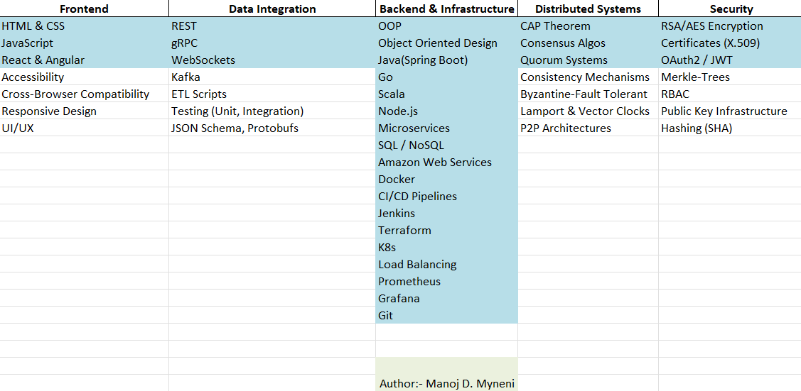

<h1 align="center">Hi 👋, I am Manoj Dattatreya Myneni</h1>
<h3 align="center">Backend Developer | Distributed Systems Engineer | Machine Learning Engineer | Love Coding which helps me in solving human problems! | I am an empathetic engineer</h3>

---

My journey in computer science began with my love for gaming, sparked by *Pokémon Fire Red* on my Gameboy Advance 🎮. Inquisitiveness and yearning to expand my horizons through systems, computers, and algorithms have become my second nature since then.  Henceforth, I have embraced challenges across multiple domains, learning from mistakes, growing, and striving to "fail better."

---

### 🛠️ T Skills

  

---

## 💼 Experience Highlights  
- **Robotics Software Engineer** at **University of Illinois Chicago – Learning + Interest + Technology (LIT) Lab** *(Autonomous Robotics & Motion Systems Research Group)*:  
  - Developed and optimized **C++ modules in ROS** for autonomous robot navigation, integrating motion planning, perception, and localization pipelines to improve path accuracy and reliability.  
  - Calibrated and tuned **LIDAR, GPS, and ultrasonic sensors**, refining fusion filters and performing A/B testing to achieve a **20% improvement in localization precision**.  
  - Diagnosed subsystem issues by analyzing telemetry logs and **CAN bus communication**, reducing operational failures by **28%** and improving fleet stability.  
  - Collaborated with hardware researchers on firmware and actuator control optimization to ensure seamless hardware–software integration.

- **Software Development Engineer** at **LTIMindtree (Enterprise Project – Citibank North America Credit Infrastructure)**:  
  - Designed backend infrastructure for the **Advanced Analytics Workbench** using **Java, Spring Boot, and AWS PCF**, integrating an AngularJS SPA and Kafka to process 500K+ customer profiles.  
  - Re-architected a **batch-based credit alert system** into an **asynchronous microservice pipeline**, reducing customer overdrafts by **25%** and increasing throughput by 3×.  
  - Optimized **PostgreSQL schema and API performance**, securing 400K+ API calls and cutting query latency by **80%**.  
  - Improved Agile release quality by **35%** through Jira-driven technical-debt reviews and automated test coverage.

---

## 🧑‍🔬 Research Experience Highlights  
- **Graduate Research Assistant** at **Honda Research Institute (UIC Human-Centered Engineering Lab Collaboration)**:  
  - Engineered VR simulations to model human–robot interaction scenarios like battery sharing and navigation confirmation in urban mobility contexts.  
  - Built modular, OOP-driven scripts using **finite state machines**, validated robot behavior through **GSR-based physiological feedback** from 50+ participants.  
  - Optimized CPU/GPU rendering,  reducing overhead by **27%** via scene refactoring, object pooling, and shader batching. 🤖  

- **MS Research Project – Argonne National Laboratory (Theta Supercomputer)**:  
  - Correlated **HPC job logs with hardware-error events** on the Theta system to enable predictive maintenance and enhance system reliability.  
  - Processed **91K+ job records** and **136K hardware-fault logs** using Python-based data analysis pipelines.  
  - Strengthened skills in **HPC systems**, **DragonFly topology**, **large-scale distributed data analysis**, and **algorithmic reliability engineering**.

---

  
## 👨‍💼 Leadership Experience

- **President**, **UIC Computer Science Graduate Student Association (CSGSA)**:  
  - Unified faculty, students, and industry professionals through events like *CS Connect*.  
  - Collaborated with the Director of Graduate Studies and the Dean of Engineering to address student concerns.  
- **Microsoft TEALS Mentor**:  
  - Volunteered to mentor high school students in computer science.

---

## 🌱 Philosophy & Interests
I believe mistakes are inevitable, but taking ownership and proactively resolving them is what defines us. I thrive on collaboration and helping others, from mentoring students on resumes to contributing to the tech community.

### 🎯 In my free time:
- You can find me catching Pokémon and filling up my Pokedex. 🎮
- Guiding junior peers toward career clarity, enhancing resumes, and encouraging open-source contributions.💡

---

### 💬 Quote of the Day

---

### 🌐 Connect with Me

 
   
   
   

### ⚽ Outside of Tech
When I am not coding, I am a huge **One Piece** fan and support **FC Barcelona**. Reach out anytime, I would love to connect!
